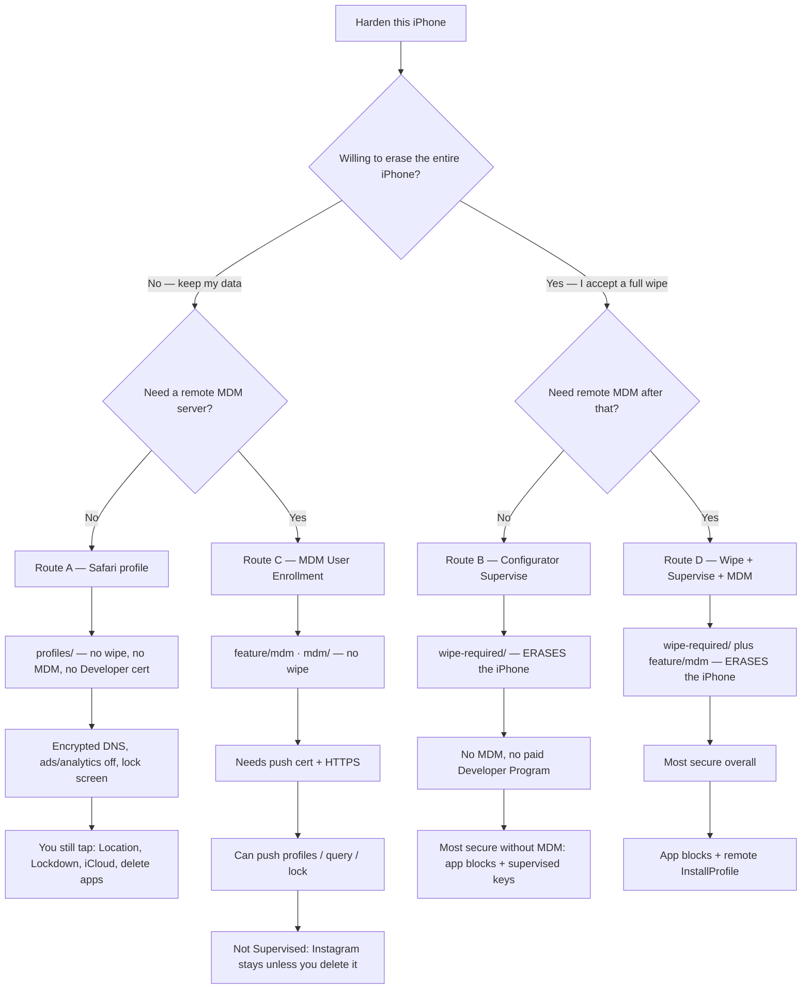

# OpenHat iOS Max Privacy

**Erase warning (read this first):** hiding Instagram/Snapchat, forcing Siri and AirDrop off, and other Supervised-only locks require Apple to **erase the entire iPhone**. That is Route B or D. Encrypted backup first. There is no unsupervise toggle — only another erase.

**Most people should stop at Route A.** It does **not** erase the iPhone, does **not** use MDM, and does **not** need a paid Developer Program.

Not every MDM path wipes the phone. Safari MDM enrollment (Route C, `feature/mdm` branch) keeps your data but **cannot** do app blocks. Full MDM + app blocks (Route D) **does** wipe.

## Which route?

| Route | Erase iPhone? | MDM? | Developer cert? | What you get | Where in this repo |
| --- | --- | --- | --- | --- | --- |
| **A — default** | **No** | **No** | **No** | DNS, telemetry/ads off, lock screen. Instagram still installable. | `profiles/` |
| **B** | **Yes** | **No** | **No** | Everything in A, plus Siri/AirDrop off, Instagram/Snapchat/TikTok hidden | `wipe-required/` |
| **C** | **No** | **Yes** | **Yes** | Remote push of Route A profiles. No app denylist. | `mdm/` on `feature/mdm` |
| **D — strongest** | **Yes** | **Yes** | **Yes** | Route B plus remote management | `wipe-required/` + `feature/mdm` |

**Most secure:** D. **Most secure without paying Apple or running a server:** B. **Do this first, no drama:** A.

---

## Route A — no wipe, no MDM (`profiles/`)

1. `python3 serve.py`
2. On the iPhone, open the URL **in Safari**.
3. Tap **Install Max Privacy**. Then **Settings → General → VPN & Device Management → Install**.
4. Finish leftover taps on the audit page (`/#audit`).

| File | When |
| --- | --- |
| `profiles/OpenHat-MaxPrivacy.mobileconfig` | Default. Mullvad Adblock DNS + unsupervised restrictions. |
| `profiles/OpenHat-MaxPrivacy-Quad9.mobileconfig` | Same with Quad9 DNS. Replaces the default. |
| `profiles/OpenHat-Passcode.mobileconfig` | Optional PIN policy. |
| `profiles/OpenHat-SafariDenyList.mobileconfig` | Optional Safari-only tracker URL list. |

Rebuild: `python3 tools/build_profile.py`

Leftover taps: Location Services, Lockdown Mode, iCloud app sync / sign-out, Private Wi-Fi Address, delete high-tracking apps (or Screen Time → Never Allow), VPN.

---

## Route B — erases the iPhone, still no MDM (`wipe-required/`)

Read [`wipe-required/README.md`](wipe-required/README.md) before you plug in a cable. Apple Configurator **Prepare → Supervise** wipes the device. Then install `wipe-required/OpenHat-Supervised.mobileconfig`.

---

## Routes C and D — MDM (`mdm/` on `feature/mdm`)

MDM is isolated from this default path. The `mdm/` stack lives on the **`feature/mdm`** branch, not on `main`. Checkout that branch only if you have a paid Apple Developer Program push certificate and a public HTTPS hostname.

- **C** = Safari enrollment profile → **no erase**, not Supervised, cannot hide Instagram.
- **D** = Configurator Prepare with Supervise **and** MDM → **erases the iPhone**, then remote app blocks.

See [`mdm/README.md`](mdm/README.md) on `feature/mdm`.

---

## Sources

- [paulmillr/encrypted-dns](https://github.com/paulmillr/encrypted-dns)
- [celenityy/ios-settings](https://github.com/celenityy/ios-settings)
- [iPrivacyGuides/iOS-Privacy-Guide](https://github.com/iPrivacyGuides/iOS-Privacy-Guide)
- [danieloz147/ios-profile-builder](https://github.com/danieloz147/ios-profile-builder) (plist assembly only)
- [Apple Restrictions payload](https://developer.apple.com/documentation/devicemanagement/restrictions)
- [NanoMDM](https://github.com/micromdm/nanomdm)
