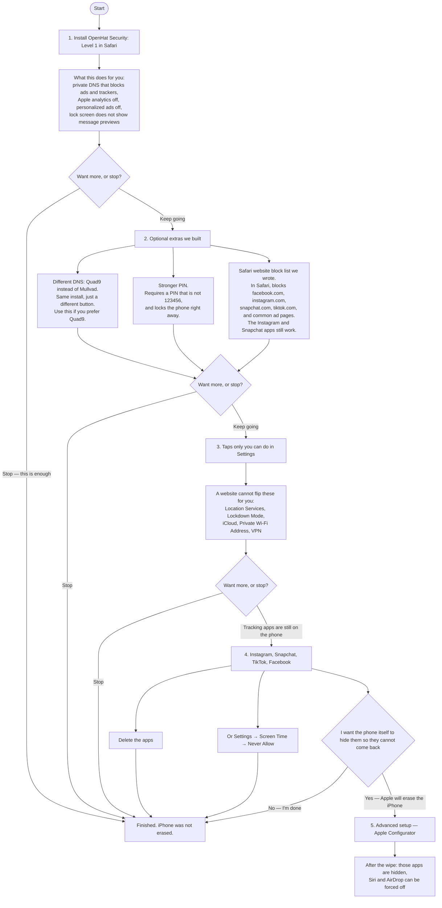
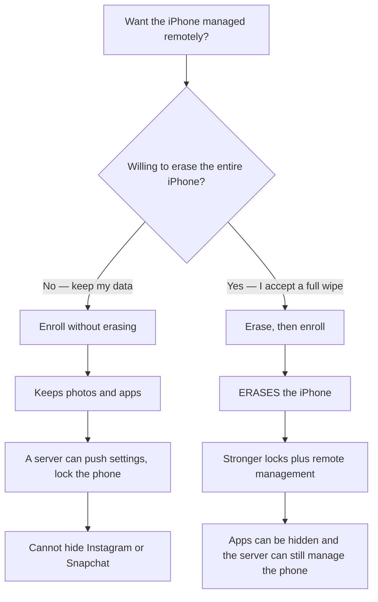

# OpenHat Max Privacy for iPhone

Install **OpenHat Max Privacy** on the iPhone. That is the main step. You can stop there.

Built for public **iOS 26** (currently 26.6). See [Supported iOS](#supported-ios).

Everything after that is optional. You can leave off at any green “stop” below. Your photos and apps stay put unless you choose the last step, which **erases the whole iPhone**. Most people never do that last step.

This branch also has a **separate** [remote management](#remote-management) path. Do not mix that chart with the personal setup below.

## Configurations



| Step | What it is | Can you stop after this? | Erases the iPhone? |
| --- | --- | --- | --- |
| **Level 1 (Mullvad or Quad9)** | The main install. Private DNS, Apple ads/analytics off, tighter lock screen. | **Yes — recommended stop** | No |
| **Level 2.11** | Level 1 plus Extra 1.1 (stronger PIN). | Yes | No |
| **Level 2.12** | Level 1 plus Extra 1.2 (Safari website list). | Yes | No |
| **Level 2.21** | Level 1 plus both extras. | Yes | No |
| **Extras 1.1 / 1.2** | PIN or Safari only, if Level 1 is already installed. | Yes | No |
| **Settings taps** | Things Apple will not let an install change: Location, Lockdown Mode, iCloud, Private Wi-Fi, VPN. | Yes | No |
| **Tracking apps** | Delete them, or Screen Time → Never Allow. | **Yes — last stop that keeps your data** | No |
| **Level 3** | Optional self-hosted MDM. **Does not erase.** You run the server. OpenHat cannot see your data. | Yes | No |
| **Level 4** | Erase with Apple Configurator, turn on Lockdown Mode, then Supervised profile. You manage it. | — | **Yes** |

---

## Step 1 — OpenHat Security: Level 1

This does **not** erase the iPhone. Stop here if you only wanted private DNS and ads/analytics off.

### Install from GitHub Pages (recommended)

1. On the iPhone, open **Safari** (not Chrome):  
   **https://openhat-security.github.io/ios-max-security/**
2. Tap the profile you want, then **Allow** when iOS prompts you.
3. Finish in **Settings → General → VPN & Device Management → Install**.

Default is **OpenHat Security: Level 1 (Mullvad)**. Pick **Level 1 (Quad9)** if you prefer that resolver. Level 2 bundles add extras in one file (`.11` = PIN, `.12` = Safari, `.21` = both).

### Local preview

```bash
echo "iPhone Safari: http://$(ipconfig getifaddr en0):8080/" && python3 -m http.server 8080 --directory src
```

Open that URL in Safari on the iPhone. GitHub Pages is the public host: **https://openhat-security.github.io/ios-max-security/**

---

## Step 2 — extras we built (optional)

Skip this whole step if step 1 is enough.

| Button on the installer | What we made | What it does not do |
| --- | --- | --- |
| **Optional: passcode policy** | A stronger PIN rule | Does not erase the phone after wrong guesses |
| **Optional: Safari tracker deny list** | Our list of websites to block **in Safari** (Facebook, Instagram, Snapchat, TikTok sites, DoubleClick, Google Analytics, and similar) | Does not remove the Instagram or Snapchat **apps**. Those still work until you delete them or use Screen Time. |

---

## Step 3 — leftover taps

Open the leftover-taps step in the Safari installer. Check off Location Services, Lockdown Mode, iCloud, Private Wi-Fi Address, and VPN. A website cannot flip those switches for you.

You can stop after this.

---

## Step 4 — tracking apps, still no erase

Instagram, Facebook, Messenger, Snapchat, TikTok, X, Pinterest, Reddit, and LinkedIn are not malware, but they build advertising graphs. Step 1 cannot hide them. Either:

- Delete the apps, or
- **Settings → Screen Time → Content & Privacy Restrictions → Never Allow**

You can stop here. This is the last step that keeps your data.

---

## Step 5 — Advanced setup (erases the iPhone)

**Skip this unless you need Supervised restrictions.** Read [wipe.html](https://openhat-security.github.io/ios-max-security/wipe.html) before you plug in a cable.

A Safari install cannot apply those locks. Apple Configurator **Prepare** supervises the device and **always erases all content and settings**.

After the wipe, turn on Lockdown Mode, then install **OpenHat Security: Level 4** from `src/profiles/` (Mullvad or Quad9). You manage that profile. OpenHat cannot see your data.

---

## Remote management

This is a **different** path. It is optional. It is not required for any personal step above. Enrolling does **not** erase the phone by itself. Combining stronger locks **with** remote management **does** erase the phone.



| Setup | Erases the iPhone? | What you get |
| --- | --- | --- |
| **Enroll without erasing** | **No** | Remote push of the personal privacy profile. Instagram stays unless you delete it. |
| **Erase, then enroll** | **Yes** | Stronger locks (app blocks, Siri / AirDrop off) **and** remote management. |

Enroll without erasing: open the enrollment page in Safari on the iPhone (`/enroll/` on your management server).

Erase, then enroll: follow [configurator.html](https://openhat-security.github.io/ios-max-security/configurator.html), turn **Supervise** on, then enroll. After that the server can install `src/profiles/OpenHat-Level-4-Mullvad.mobileconfig`.

How to run the server: [`mdm/README.md`](mdm/README.md).

---

## Supported iOS

| | Version |
| --- | --- |
| Current public iOS we build against | **iOS 26.6** |
| Full restriction set (Apple Intelligence keys) | **iOS 18.2 and later** |
| Optional Safari website block list | **iOS 16 and later** |
| Encrypted DNS | **iOS 14 and later** |
| iOS 27 developer / public beta | **Not supported** until Apple ships it |

Unknown restriction keys are ignored on older iOS. The leftover Settings checklist is the same on every version: a website cannot flip those switches.

## No pip, no extra packages

Every Python file in this repo uses the **Python 3 standard library only**. That includes `build_profile.py` and the optional MDM helpers (`mdm/generate_enrollment.py`, `mdm/enqueue_profile.py`). There is no `requirements.txt`, no virtualenv, and no third-party package to install or supply-chain review.

That is intentional. You can read every `import` in a minute. We will not add PyPI dependencies. The public installer is static HTML on GitHub Pages. The optional MDM server is Docker images you pin yourself (NanoMDM, SCEP, Caddy), not Python packages we vendor.

## Contributing

Bug reports, catalog items, and installer changes are welcome. Read [CONTRIBUTING.md](CONTRIBUTING.md) before opening a pull request. This project follows the [Contributor Covenant](CODE_OF_CONDUCT.md). Security reports go through [SECURITY.md](SECURITY.md), not a public issue.

## License

[MIT](LICENSE).

## Sources

- [paulmillr/encrypted-dns](https://github.com/paulmillr/encrypted-dns)
- [celenityy/ios-settings](https://github.com/celenityy/ios-settings)
- [iPrivacyGuides/iOS-Privacy-Guide](https://github.com/iPrivacyGuides/iOS-Privacy-Guide)
- [danieloz147/ios-profile-builder](https://github.com/danieloz147/ios-profile-builder)
- [Apple Restrictions payload](https://developer.apple.com/documentation/devicemanagement/restrictions)
- [NanoMDM](https://github.com/micromdm/nanomdm)
