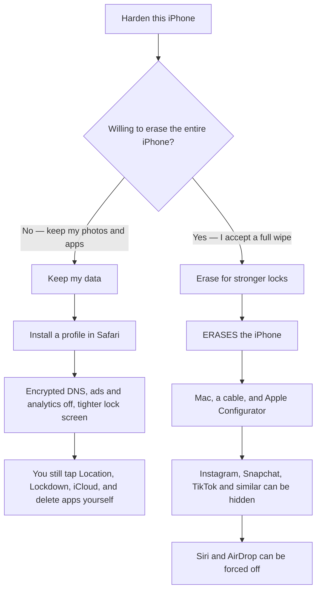

# OpenHat Max Privacy for iPhone

**Read this first.** One of the two setups below **erases your whole iPhone**. The other does not. If you choose the erase path, make an encrypted backup first. There is no undo except another erase.

Most people should **keep their data**.

## Which setup?

| Setup | Erases the iPhone? | What you get |
| --- | --- | --- |
| **Keep my data** | **No** | Encrypted DNS, ads and analytics off, tighter lock screen. Instagram and Snapchat stay until you delete them. |
| **Erase for stronger locks** | **Yes** | Everything above, plus those apps can be blocked and Siri / AirDrop forced off. This is the more private of the two. |

---

## Keep my data

This does **not** erase the iPhone.

1. On a computer in this folder, run `python3 serve.py`.
2. On the iPhone, open the printed URL **in Safari** (not Chrome).
3. Tap **Install Max Privacy**. Then **Settings → General → VPN & Device Management → Install**.
4. Open the audit page (`/#audit`) and finish the leftover taps.

| File | When |
| --- | --- |
| `profiles/OpenHat-MaxPrivacy.mobileconfig` | Default. Mullvad Adblock DNS plus privacy restrictions. |
| `profiles/OpenHat-MaxPrivacy-Quad9.mobileconfig` | Same, with Quad9 DNS. Replaces the default. |
| `profiles/OpenHat-Passcode.mobileconfig` | Optional PIN policy. |
| `profiles/OpenHat-SafariDenyList.mobileconfig` | Optional Safari-only tracker list. |

Leftover taps the profile cannot do for you: Location Services, Lockdown Mode, iCloud app sync / sign-out, Private Wi-Fi Address, delete high-tracking apps (or Screen Time → Never Allow), VPN.

---

## Erase for stronger locks

**This wipes the iPhone.** Read [`wipe-required/README.md`](wipe-required/README.md) before you plug in a cable.

Apple Configurator **Prepare** erases all content and settings. After that, install `wipe-required/OpenHat-Supervised.mobileconfig` to hide Instagram, Snapchat, TikTok, and similar, and to force Siri and AirDrop off.

---

## Sources

- [paulmillr/encrypted-dns](https://github.com/paulmillr/encrypted-dns)
- [celenityy/ios-settings](https://github.com/celenityy/ios-settings)
- [iPrivacyGuides/iOS-Privacy-Guide](https://github.com/iPrivacyGuides/iOS-Privacy-Guide)
- [danieloz147/ios-profile-builder](https://github.com/danieloz147/ios-profile-builder)
- [Apple Restrictions payload](https://developer.apple.com/documentation/devicemanagement/restrictions)
