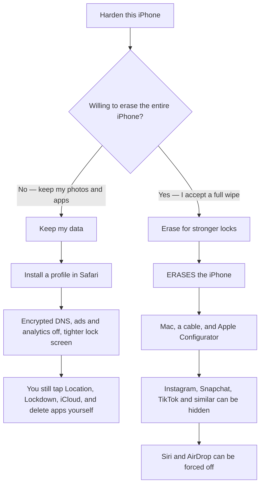
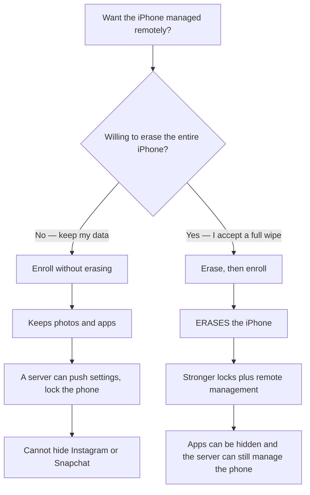

# OpenHat Max Privacy for iPhone

This branch is the **remote management** edition. Personal setup (no remote management) is a separate choice with its own diagram. Do not mix the two charts.

**Read this first.** Erasing the iPhone is required only for the stronger locks (hide Instagram / Snapchat, force Siri and AirDrop off). Enrolling for remote management does **not** erase the phone by itself. Combining stronger locks **with** remote management **does** erase the phone.

---

## Personal setup

No remote management. Most people should **keep their data**.

| Setup | Erases the iPhone? | What you get |
| --- | --- | --- |
| **Keep my data** | **No** | Encrypted DNS, ads and analytics off, tighter lock screen. Instagram and Snapchat stay until you delete them. |
| **Erase for stronger locks** | **Yes** | Everything above, plus those apps can be blocked and Siri / AirDrop forced off. |

Keep my data: run `python3 serve.py`, open the URL in Safari, tap **Install Max Privacy**.

Erase for stronger locks: read [`wipe-required/README.md`](wipe-required/README.md) before you plug in a cable.

---

## Remote management

This is a **different** path. It is optional. It is not required for either personal setup above.

| Setup | Erases the iPhone? | What you get |
| --- | --- | --- |
| **Enroll without erasing** | **No** | Remote push of the personal privacy profile. Instagram stays unless you delete it. |
| **Erase, then enroll** | **Yes** | Stronger locks (app blocks, Siri / AirDrop off) **and** remote management. The more private of these two. |

Enroll without erasing: open the enrollment page in Safari on the iPhone (`/enroll/` on your management server).

Erase, then enroll: follow [`wipe-required/CONFIGURATOR.md`](wipe-required/CONFIGURATOR.md), turn **Supervise** on, then enroll. After that the server can install `wipe-required/OpenHat-Supervised.mobileconfig`.

How to run the server: [`mdm/README.md`](mdm/README.md).

---

## Sources

- [paulmillr/encrypted-dns](https://github.com/paulmillr/encrypted-dns)
- [celenityy/ios-settings](https://github.com/celenityy/ios-settings)
- [iPrivacyGuides/iOS-Privacy-Guide](https://github.com/iPrivacyGuides/iOS-Privacy-Guide)
- [danieloz147/ios-profile-builder](https://github.com/danieloz147/ios-profile-builder)
- [Apple Restrictions payload](https://developer.apple.com/documentation/devicemanagement/restrictions)
- [NanoMDM](https://github.com/micromdm/nanomdm)
