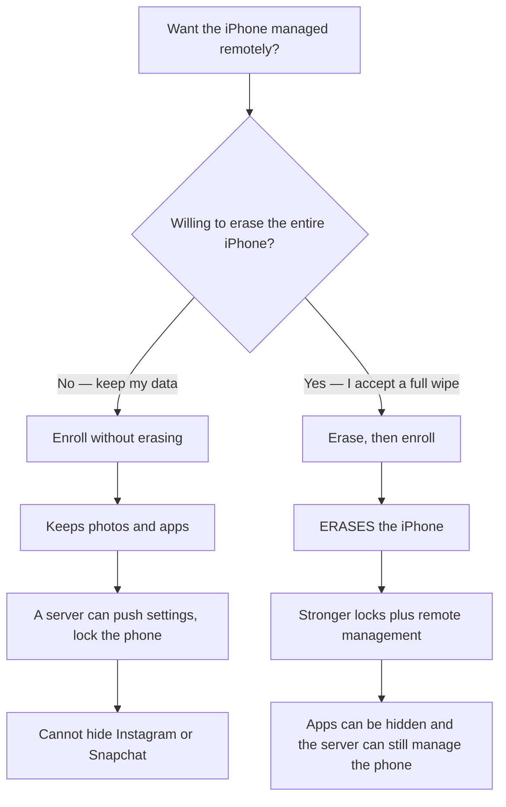

# Remote management server

This folder is **not** the personal installer. The Safari profile in `src/profiles/` never enrolls a phone here.

The Python here (`generate_enrollment.py`, `enqueue_profile.py`) is **stdlib only** — `plistlib`, `urllib.request`, no pip. Keep it that way. The server itself is Docker (NanoMDM, SCEP, Caddy), not a Python package.

The user-facing MDM chart lives in the [root README](../README.md#remote-management). This page is how to run the server.



| Setup | Erases the iPhone? | What the server can do |
| --- | --- | --- |
| **Enroll without erasing** | **No** | Push the personal privacy profile, query, lock. Cannot hide Instagram. |
| **Erase, then enroll** | **Yes** | App blocks plus remote management. |

## Run the server

You can self-host (`MDM_PROVIDER=self`) or point enrollment at a hosted OpenHat URL (`MDM_PROVIDER=openhat`).

You will need:

1. An MDM push certificate from [identity.apple.com](https://identity.apple.com). See MicroMDM’s [APNs cert notes](https://github.com/micromdm/micromdm/blob/main/docs/user-guide/quickstart.md).
2. A public HTTPS hostname (Caddy in this compose uses Let’s Encrypt). Example: `mdm.example.com`.
3. Devices you are allowed to manage. Enrolling someone else’s phone without consent is not supported.

### Enroll without erasing

```bash
cd mdm
cp config.example.env .env
# edit .env — MDM_PUBLIC_URL, secrets, leave PUSH files empty until you have the cert

./bootstrap.sh
./generate_enrollment.py

# after you have push.pem + push.key:
./upload_pushcert.sh
# paste the returned Topic into .env as MDM_TOPIC and regenerate enrollment

./enqueue_profile.py ../src/profiles/OpenHat-Level-1-Mullvad.mobileconfig --udid DEVICE_UDID
```

Open `https://$MDM_PUBLIC_URL/enroll/` in Safari on the iPhone. That enrollment **does not erase** the phone.

### Erase, then enroll

1. Read [`../src/configurator.html`](../src/configurator.html). **Prepare erases the iPhone.**
2. In Configurator Prepare, enable **Supervise** and MDM enrollment, pointing at `https://$MDM_PUBLIC_URL/enroll/OpenHat-MDM-Enroll.mobileconfig` (or install that profile after setup).
3. After enrollment:

```bash
./enqueue_profile.py ../src/profiles/OpenHat-Level-4-Mullvad.mobileconfig --udid DEVICE_UDID
```

## Layout

| Path | Role |
| --- | --- |
| `docker-compose.yml` | Caddy (HTTPS) + SCEP :8080 + NanoMDM :9000 |
| `Caddyfile` | TLS termination, `/scep` `/mdm` `/v1` `/enroll` |
| `generate_enrollment.py` | Stdlib: builds SCEP + MDM payloads from `.env` |
| `enqueue_profile.py` | Stdlib: `InstallProfile` to one device (`urllib.request`) |
| `pki/` `db/` `depot/` `out/` | Local secrets and enrollment HTML — gitignored |

AccessRights default is `8191` (all, including remote wipe). Narrow this in `.env` if you do not want the server to be able to erase the device later.
