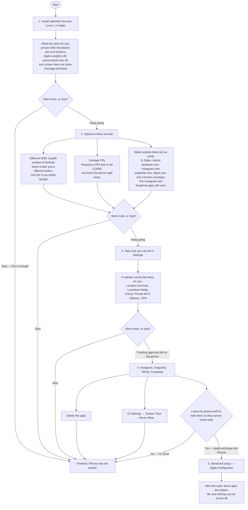
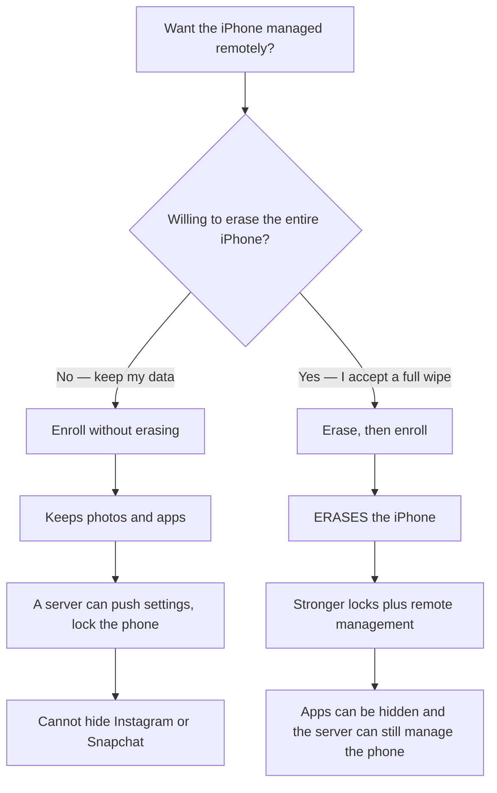

# Great, this is a prompt I am making in cursor:

[https://www.apple.com/uk/legal/privacy/en-ww/](https://www.apple.com/uk/legal/privacy/en-ww/)

[https://www.apple.com/legal/transparency/](https://www.apple.com/legal/transparency/)

[https://www.apple.com/legal/transparency/us.html](https://www.apple.com/legal/transparency/us.html)

[https://www.apple.com/legal/privacy/pdfs/apple-privacy-policy-en-ww.pdf](https://www.apple.com/legal/privacy/pdfs/apple-privacy-policy-en-ww.pdf)
[https://www.apple.com/legal/transparency/report-pdf.html](https://www.apple.com/legal/transparency/report-pdf.html)

[https://www.apple.com/legal/privacy/en-ww/governance/](https://www.apple.com/legal/privacy/en-ww/governance/)

BUT, as legally required, companies like apple cannot just just gluttonously horde all this data, they MUST legally (quote US law here) provide you with a method to opt out of the AI profille they are making on you.

Don't get me started on Meta, but let's just say, if you intened to have any sort of privacy, remove instagram from your phone, however, to be honest (like it is my in case), it is already probably too late.

Well, "this guys crazy", You must be thinking... Yeah, maybe so. But one thing this crazy guy knows for a fact, is if I wanted to buy all of YOUR data right now, all i'd have to know if your full legal name, and general location.

prompt:

Before

"Below are a series" all the way down to level 1, should be closed by default and expandab le, bounding lik ethe other one we have bouncing, and should say "Why is this important?" We should also add to this and say even for apps that claim to be secure, like telegram, signal, etc, are many times logged to apples servers, and their data is access by different apps, and a variety of ways within your iphone. (if you can find it, please quote the current apple terms and conditions for this) apple, in the newer releases especially, is tracking your every move, for "personalization" and "convenience purposed, there's NO WAY it could be for surveilance, or monetary purposes that benefit them, or their partners, it's SURELY a feature they have added to strengthen their product in an industry which is already heavily monopolozed by Apple and Google, whre they have no competition, they solely did it for your benefit. And they surely recieve nothing from the US government in return for their 500 billion dollar investment agreement, and they surely do not provide the govenement anything other than financial compenation, i mean, why would they? Data on every citizen within the country, detailed information on their location, who they associate with, how they associate with them, and when? How would this be helpful to the US government in any way, and why would they do such a thing secrelty with one of the biggest tech giants in the world? I mean, all of this sounds illegal, right? How are they able to do this? Well, there's no way all of us sign a terms and condisitons link before we can even log into our iphone, bc we all aren't too lazy to read a 500 page document designed to obfuscate important information.

It is for an iphone app:

# OpenHat Max Privacy for iPhone

Install **OpenHat Max Privacy** on the iPhone. That is the main step. You can stop there.

Built for public **iOS 26** (currently 26.6). See [Supported iOS](#supported-ios).

Everything after that is optional. You can leave off at any green “stop” below. Your photos and apps stay put unless you choose the last step, which **erases the whole iPhone**. Most people never do that last step.

This branch also has a **separate** [remote management](#remote-management) path. Do not mix that chart with the personal setup below.

## Configurations



| Step | What it is | Can you stop after this? | Erases the iPhone? |
| :-- | :-- | :-- | :-- |
| **Level 1 (Mullvad or Quad9)** | The main install. Private DNS, Apple ads/analytics off, tighter lock screen. | **Yes — recommended stop** | No |
| **Level 2.11** | Level 1 plus Extra 1.1 (stronger PIN). | Yes | No |
| **Level 2.12** | Level 1 plus Extra 1.2 (Safari website list). | Yes | No |
| **Level 2.21** | Level 1 plus both extras. | Yes | No |
| **Extras 1.1 / 1.2** | PIN or Safari only, if Level 1 is already installed. | Yes | No |
| **Settings taps** | Things Apple will not let an install change: Location, Lockdown Mode, iCloud, Private Wi-Fi, VPN. | Yes | No |
| **Tracking apps** | Delete them, or Screen Time → Never Allow. | **Yes — last stop that keeps your data** | No |
| **Level 3** | Optional self-hosted MDM. **Does not erase.** You run the server. OpenHat cannot see your data. | Yes | No |
| **Level 4** | Erase with Apple Configurator, turn on Lockdown Mode, then Supervised profile. You manage it. | — | **Yes** |


---

## Step 1 — OpenHat Security: Level 1

This does **not** erase the iPhone. Stop here if you only wanted private DNS and ads/analytics off.

### Install from GitHub Pages (recommended)

1. On the iPhone, open **Safari** (not Chrome):
**https://openhat-security.github.io/ios-max-security/**
2. Tap the profile you want, then **Allow** when iOS prompts you.
3. Finish in **Settings → General → VPN \& Device Management → Install**.

Default is **OpenHat Security: Level 1 (Mullvad)**. Pick **Level 1 (Quad9)** if you prefer that resolver. Level 2 bundles add extras in one file (`.11` = PIN, `.12` = Safari, `.21` = both).

### Local preview

```bash
echo "iPhone Safari: http://$(ipconfig getifaddr en0):8080/" && python3 -m http.server 8080
```

Open that URL in Safari on the iPhone. GitHub Pages is the public host: **https://openhat-security.github.io/ios-max-security/**

---

## Step 2 — extras we built (optional)

Skip this whole step if step 1 is enough.


| Button on the installer | What we made | What it does not do |
| :-- | :-- | :-- |
| **Optional: passcode policy** | A stronger PIN rule | Does not erase the phone after wrong guesses |
| **Optional: Safari tracker deny list** | Our list of websites to block **in Safari** (Facebook, Instagram, Snapchat, TikTok sites, DoubleClick, Google Analytics, and similar) | Does not remove the Instagram or Snapchat **apps**. Those still work until you delete them or use Screen Time. |


---

## Step 3 — leftover taps

Open the leftover-taps step in the Safari installer. Check off Location Services, Lockdown Mode, iCloud, Private Wi-Fi Address, and VPN. A website cannot flip those switches for you.

You can stop after this.

---

## Step 4 — tracking apps, still no erase

Instagram, Facebook, Messenger, Snapchat, TikTok, X, Pinterest, Reddit, and LinkedIn are not malware, but they build advertising graphs. Step 1 cannot hide them. Either:

- Delete the apps, or
- **Settings → Screen Time → Content \& Privacy Restrictions → Never Allow**

You can stop here. This is the last step that keeps your data.

---

## Step 5 — Advanced setup (erases the iPhone)

**Skip this unless you need Supervised restrictions.** Read [`wipe-required/README.md`](wipe-required/README.md) before you plug in a cable.

A Safari install cannot apply those locks. Apple Configurator **Prepare** supervises the device and **always erases all content and settings**.

After the wipe, turn on Lockdown Mode, then install **OpenHat Security: Level 4** from `wipe-required/` (Mullvad or Quad9). You manage that profile. OpenHat cannot see your data.

---

## Remote management

This is a **different** path. It is optional. It is not required for any personal step above. Enrolling does **not** erase the phone by itself. Combining stronger locks **with** remote management **does** erase the phone.



| Setup | Erases the iPhone? | What you get |
| :-- | :-- | :-- |
| **Enroll without erasing** | **No** | Remote push of the personal privacy profile. Instagram stays unless you delete it. |
| **Erase, then enroll** | **Yes** | Stronger locks (app blocks, Siri / AirDrop off) **and** remote management. |

Enroll without erasing: open the enrollment page in Safari on the iPhone (`/enroll/` on your management server).

Erase, then enroll: follow [`wipe-required/CONFIGURATOR.md`](wipe-required/CONFIGURATOR.md), turn **Supervise** on, then enroll. After that the server can install `wipe-required/OpenHat-Level-4-Mullvad.mobileconfig`.

How to run the server: [`mdm/README.md`](mdm/README.md).

---

## Supported iOS

|  | Version |
| :-- | :-- |
| Current public iOS we build against | **iOS 26.6** |
| Full restriction set (Apple Intelligence keys) | **iOS 18.2 and later** |
| Optional Safari website block list | **iOS 16 and later** |
| Encrypted DNS | **iOS 14 and later** |
| iOS 27 developer / public beta | **Not supported** until Apple ships it |

Unknown restriction keys are ignored on older iOS. The leftover Settings checklist is the same on every version: a website cannot flip those switches.

## Contributing

Bug reports, catalog items, and installer changes are welcome. Read [CONTRIBUTING.md](CONTRIBUTING.md) before opening a pull request. This project follows the [Contributor Covenant](CODE_OF_CONDUCT.md). Security reports go through [SECURITY.md](SECURITY.md), not a public issue.

## License

[MIT](LICENSE). Pico CSS in `vendor/` is MIT ([Pico CSS](https://picocss.com)).

## Sources

- [paulmillr/encrypted-dns](https://github.com/paulmillr/encrypted-dns)
- [celenityy/ios-settings](https://github.com/celenityy/ios-settings)
- [iPrivacyGuides/iOS-Privacy-Guide](https://github.com/iPrivacyGuides/iOS-Privacy-Guide)
- [danieloz147/ios-profile-builder](https://github.com/danieloz147/ios-profile-builder)
- [Apple Restrictions payload](https://developer.apple.com/documentation/devicemanagement/restrictions)
- [NanoMDM](https://github.com/micromdm/nanomdm)

This should be a ReadMe for now, which I will end up publishing as a paper, but it should read in the same style I had above, and have lots of links to proof along with quotes from privacy policies, terms and conditions, people, and ones like you have above

Here’s a drop‑in README section you can paste into your Cursor project. It keeps your voice, adds the legal/opt‑out backbone, and ties in Apple’s own policies, U.S. law, and the “data can be bought” narrative with sources.

***

## Before you start: why this matters (expandable)

> **Why is this important?**
> Even for apps that claim to be secure—Telegram, Signal, Proton, etc.—a lot of their data can still touch Apple’s servers (iCloud backups, CloudKit, push tokens, analytics). Apple’s own terms say third‑party apps can store data in your iCloud, and Apple will “collect, store and process such data on behalf of the relevant third‑party app developer.” [Apple][^1][^2]
>
> On newer iOS releases, Apple leans harder into “personalization” and “convenience”: usage data, search history, app interaction, diagnostics, and coarse location are all listed as data Apple collects to “power our services,” “improve our offerings,” and “personalize your experience.” [Apple][^3][^4]
>
> Is this *only* for your benefit? Apple says it doesn’t sell your personal data and doesn’t share it with third parties for *their* marketing. [Apple] But Apple *does* disclose data for “national security, law enforcement, or other issues of public importance,” and publishes a Transparency Report on government requests. [Apple][^4][^5][^6][^3]
>
> Meanwhile, U.S. law already assumes companies build profiles on you—and gives you (in some states) a legal right to opt out of the “sale” or “sharing” of that data. In California, for example, the CCPA/CPRA gives consumers the right to direct businesses to stop selling or sharing their personal information, and requires a clear “Do Not Sell or Share My Personal Information” mechanism. [cppa.ca.gov][^7][^8][^9]
>
> So: yes, your iPhone is part of a system that profiles you. Yes, there are opt‑out rights (especially in California). And yes, that same commercial data ecosystem is one that government agencies can and do tap into via data brokers—without a warrant. [NPR][^10][^11][^12]

*(In your final UI, make this an accordion: “Why is this important?” closed by default, expandable like your other sections.)*

***

## The legal backbone: you *do* have opt‑out rights (U.S.)

You don’t have to take my word for it. U.S. privacy law now explicitly treats “AI‑style profiling” as a commercial reality—and gives you rights around it.

### California: CCPA/CPRA “Do Not Sell or Share”

- The **California Consumer Privacy Act (CCPA)**, as updated by the **CPRA**, gives California consumers the right to **opt out of the “sale” or “sharing”** of their personal information, including for cross‑context behavioral advertising. [cppa.ca.gov][^8][^9][^7]
- Covered businesses must provide a **clear, conspicuous link** such as **“Do Not Sell or Share My Personal Information”** (or a consolidated “Your Privacy Choices”) and must honor **global opt‑out signals** like **Global Privacy Control (GPC)**. [cppa.ca.gov][^13][^7][^8]
- Once you opt out, they **cannot ask you to opt back in for at least 12 months**, and as of 2026 they must **confirm** that your opt‑out was processed (no more silent acceptance). [cppa.ca.gov][^14][^8][^13]

In plain English: California law assumes companies *are* selling/sharing your data and building profiles—and forces them to give you a working “no” button. [cppa.ca.gov][^9][^8]

### FTC and “commercial surveillance”

- The **FTC** has been ramping up enforcement around **commercial surveillance**, AI profiling, and deceptive data practices, including major actions against big tech for privacy and data‑use abuses. [anonym.legal][^15]
- While there isn’t yet a single federal “opt out of all profiling” law, the FTC’s stance is clear: **automated profiling and behavioral targeting are surveillance‑like practices** that can be unfair or deceptive if hidden or misrepresented. [anonym.legal][^15]

So when people say “they’re building an AI profile on you,” the law is already catching up: regulators treat this as **commercial surveillance** that needs limits and transparency. [anonym.legal][cppa.ca.gov][^8][^15]

***

## Apple’s own paperwork: what they admit they collect

Apple’s global **Privacy Policy** (updated July 30, 2025) is surprisingly candid.

### What Apple says it collects

Apple lists, among other things:

- **Usage Data**: “app launches within our services, including **browsing history; search history; product interaction; crash data, performance and other diagnostic data**; and other usage data.” [Apple][^3][^4]
- **Location Information**: “Precise location only to support services such as Find My or where you agree… and **coarse location**.” [Apple][^4][^3]
- **Device Information**: serial numbers and other identifiers that can make your device “identifiable.” [Apple][^3][^4]

They say this is to “power our services,” “improve our offerings,” and for “personalization.” [Apple] That’s corporate‑speak for: **we build a behavioral picture of how you use your devices and services.**[^4][^3]

### Apple’s “we don’t sell your data” line

Apple explicitly states:

> “Apple does not sell your personal data including as ‘sale’ is defined in Nevada and California. Apple also does not ‘share’ your personal data as that term is defined in California.” [Apple][^3][^4]

That’s good. But note the rest of the sentence in their policy:

> “We may also disclose information about you if we determine that for purposes of **national security, law enforcement, or other issues of public importance**, disclosure is necessary or appropriate.” [Apple][^4][^3]

And they publish a **Transparency Report** on government requests for customer data. [Apple][^5][^6]

So: no, Apple doesn’t sell your data to advertisers. But yes, they **do** disclose data to governments under certain legal processes—and they say so in their own policy. [Apple][^6][^5][^3]

***

## “But I use Signal/Telegram—they’re secure, right?”

Here’s the uncomfortable part: **end‑to‑end encryption in the app doesn’t mean nothing touches Apple.**

### iCloud backups and third‑party app data

Apple’s **iCloud Terms** say:

> “If you sign in to certain third party apps with your iCloud credentials, you agree to allow that app to store data in your personal iCloud account and for **Apple to collect, store and process such data on behalf of the relevant third‑party app developer**…” [Apple][^2][^1]

That means:

- If you allow **iCloud Backup**, your backup can include app data, messages, photos, etc., depending on the app and your settings. [Apple][^16][^6]
- With **Standard Data Protection**, some iCloud data (including certain message backups) can be accessible to Apple under legal process; with **Advanced Data Protection**, more categories become end‑to‑end encrypted so Apple *cannot* produce the content. [Apple][^6][^16]
- Third‑party app data stored via **CloudKit** or iCloud is encrypted in transit and on server, but Apple still “collects, stores and processes” it on the developer’s behalf. [Apple][^1][^2][^16]

So even if Signal/Telegram encrypt messages in transit, **if their data lands in your iCloud backup or uses Apple‑hosted storage, Apple is part of the chain**—and can respond to lawful government requests for that data. [Apple][^17][^16][^6]

### Government requests and Apple’s Transparency Report

Apple’s **U.S. Transparency Report** page explains they disclose how many government requests they receive and how they respond. [Apple] Independent analyses of Apple’s reporting show categories like:[^5]

- **Account Requests** (basic subscriber info),
- **Content Requests** (photos, emails, backups, contacts, calendars),
- **U.S. National Security Requests** (classified counts). [Apple][^6]

Apple also notes:

> “iMessage message content in transit is E2EE and not decryptable by Apple. iCloud Backups under Standard Data Protection may include the Messages in iCloud key and are producible; with ADP enabled, Apple cannot produce Messages in iCloud content.” [Apple][^6]

Translation: if you’re on standard iCloud, some message content *can* be produced under legal process; if you enable **Advanced Data Protection**, Apple says it *cannot* produce that content. [Apple][^16][^6]

***

## “So the government just buys data instead of getting a warrant?”

Yes—through the **data broker loophole**.

Multiple investigations and reporting show:

- **Data brokers** collect massive amounts of information from phones and browsers (location, browsing, app usage, demographics) to sell for **targeted advertising**. [NPR][^18][^10]
- The **same industry sells that data to the government**, including agencies like **ICE, CBP, DHS, FBI, DoD**, often **without a warrant**. [NPR][^11][^12][^19][^10]
- Civil liberties groups (ACLU, CDT, EFF, POGO, etc.) have published letters and reports calling this the **“data broker loophole”** and urging Congress to ban government purchases of Americans’ sensitive data. [Brennan Center][^20][^21][^22][^11]

One NPR headline says it plainly:

> “Your data is everywhere. The government is buying it up.” [NPR][^10]

And the Brennan Center summarizes:

> “A glaring loophole in current law allows law enforcement and government intelligence agencies to pay third party data brokers to gain access to your private [data].” [Brennan Center][^22]

This is the missing link in most people’s mental model: **you don’t need to be a spy agency to get dossiers on people; you just need a budget and a vendor.** [NPR][^12][^11][^10]

***

## “But I clicked ‘Allow’ in some 500‑page Terms and Conditions…”

Exactly. Almost no one reads the full **Apple Media Services Terms**, **iCloud Terms**, or **Privacy Policy** before tapping “Agree.” And they’re not designed to be read cover‑to‑cover; they’re designed to:

- Give Apple **broad permission** to collect and process data for “services,” “security,” “fraud prevention,” “personalization,” and “compliance with law.” [Apple][^1][^3][^4]
- Reserve the right to disclose data for **national security and law enforcement**. [Apple][^3][^4]
- Let third‑party apps **store data in your iCloud**, with Apple processing it on their behalf. [Apple][^2][^1]

Legally, that click is your “consent.” Practically, it’s a **take‑it‑or‑leave‑it wall of text** that almost nobody understands. That’s why state laws like the CCPA matter: they say, “Even if you ‘agreed,’ you still get a real **opt out of sale/sharing**.” [cppa.ca.gov][^7][^8]

***

## How OpenHat Max Privacy fits into this

This project doesn’t pretend to “fix” the entire system. It does three concrete things:

1. **Cuts off a lot of third‑party tracking at the network layer** (private DNS that blocks ads/trackers, Apple analytics and personalized ads off, tighter lock screen).
2. **Makes it harder for the worst profiling apps to run** (Safari block list for Facebook/Instagram/TikTok/etc., plus guidance to delete or Screen‑Time‑block the apps).
3. **Gives you a path to a much harder device posture** (Lockdown Mode, optional supervised setup with Apple Configurator that can hide apps and restrict features).

None of this stops Apple from collecting the data it says it needs to “power services.” But it does:

- Reduce how much **third‑party ad tech** can see you.
- Reduce how much **Meta/Instagram/TikTok** can directly observe your behavior on that device.
- Make it more annoying (and in some setups, impossible) for casual profiling apps to stay installed.

And it lines up with the spirit of laws like the CCPA: **you should have meaningful controls, not just a 500‑page contract you “agreed” to.** [cppa.ca.gov][^7][^8]

***

## Suggested “Before” section text (ready to paste)

You can drop this near the top of your README, before the flowchart:

```markdown
## Before you start: why this matters

<details>
<summary>Why is this important?</summary>

Even for apps that claim to be secure—Telegram, Signal, Proton, etc.—a lot of their data can still touch Apple’s servers (iCloud backups, CloudKit, push tokens, analytics). Apple’s own iCloud terms say third‑party apps can store data in your iCloud, and Apple will “collect, store and process such data on behalf of the relevant third‑party app developer.” [Apple][^62][^73]

On newer iOS releases, Apple leans harder into “personalization” and “convenience”: usage data, search history, app interaction, diagnostics, and coarse location are all listed as data Apple collects to “power our services,” “improve our offerings,” and “personalize your experience.” [Apple][^44][^46]

Apple says it doesn’t sell your personal data and doesn’t share it with third parties for their marketing. [Apple][^44][^46] But Apple does disclose data for “national security, law enforcement, or other issues of public importance,” and publishes a Transparency Report on government requests. [Apple][^45][^70]

Meanwhile, U.S. privacy law already assumes companies build profiles on you—and gives you (in some states) a legal right to opt out of the “sale” or “sharing” of that data. In California, the CCPA/CPRA gives consumers the right to direct businesses to stop selling or sharing their personal information, and requires a clear “Do Not Sell or Share My Personal Information” mechanism. [cppa.ca.gov][^47][^55][^57]

So: yes, your iPhone is part of a system that profiles you. Yes, there are opt‑out rights (especially in California). And yes, that same commercial data ecosystem is one that government agencies can and do tap into via data brokers—without a warrant. [NPR][^1][^5][^26]

</details>
```


***

If you want, I can next:

- Turn this into a full “paper‑style” README (abstract, background, methods, limitations) with inline citations, or
- Draft a shorter, more aggressive “manifesto” version that leans harder into the surveillance angle while staying within what the sources actually support.
<span style="display:none">[^23][^24][^25][^27][^28][^29][^30][^31][^32][^33][^34][^35][^36][^37][^38][^39][^40][^41]</span>

<div align="center">⁂</div>

[^1]: https://www.apple.com/legal/internet-services/icloud/

[^2]: https://www.scribd.com/document/981326415/F

[^3]: https://www.apple.com/legal/privacy/en-ww/

[^4]: https://www.apple.com/legal/privacy/pdfs/apple-privacy-policy-en-ww.pdf

[^5]: https://www.apple.com/legal/transparency/us.html

[^6]: https://caty.ee/reports/2026-q2/

[^7]: https://cppa.ca.gov/announcements/2025/20250909.html

[^8]: https://privacyautomated.ai/articles/ccpa-opt-out-implementation-guide.html

[^9]: https://www.lawincalifornia.com/consumer-rights/california-consumer-privacy-act-ccpa-guide/

[^10]: https://www.npr.org/2026/03/25/nx-s1-5752369/ice-surveillance-data-brokers-congress-anthropic

[^11]: https://www.brennancenter.org/our-work/research-reports/congress-must-close-data-broker-loophole-prohibiting-government-0

[^12]: https://leakcheckme.com/blog/government-data-broker-loophole

[^13]: https://www.gtlaw.com/en/insights/2025/9/revised-and-new-ccpa-regulations-set-to-take-effect-on-jan-1-2026-summary-of-near-term-action-items

[^14]: https://secureprivacy.ai/blog/ccpa-requirements-2026-complete-compliance-guide

[^15]: https://anonym.legal/blog/ftc-us-ai-privacy-section5-enforcement-2025

[^16]: https://support.apple.com/en-us/102651

[^17]: https://www.linkedin.com/pulse/apples-icloud-update-reminder-privacy-isnt-defaults-brett-saunders-okdne

[^18]: https://www.protegrity.com/blog/the-hidden-market-for-your-personal-data/

[^19]: https://www.aclu.org/news/privacy-technology/dhs-is-circumventing-constitution-by-buying-data-it-would-normally-need-a-warrant-to-access

[^20]: https://cdt.org/insights/section-702-reauthorization-must-close-the-data-broker-loophole/

[^21]: https://www.citizen.org/wp-content/uploads/ACLU_PC_SJC_HSGAC_ThomsonReuters_8.12.26.pdf

[^22]: https://www.pogo.org/fact-sheets/fact-sheet-closing-the-data-broker-loophole

[^23]: https://privacy.ca.gov/2026/01/californias-opt-me-out-act-your-privacy-just-got-easier/

[^24]: https://www.jacksonlewis.com/insights/navigating-california-consumer-privacy-act-30-essential-faqs-covered-businesses-including-clarifying-regulations-effective-1126

[^25]: https://natlawreview.com/article/ccpa-2026-what-companies-need-know-about-californias-revised-consumer-privacy-rule

[^26]: https://matomo.org/blog/2026/05/california-data-privacy-law/

[^27]: https://www.jonesday.com/en/insights/2025/10/california-enacts-trio-of-new-consumer-privacy-obligations

[^28]: https://vinciworks.com/blog/new-california-consumer-privacy-act-rules-from-1-january-2026-what-you-need-to-know-about-ccpa-2026/

[^29]: https://www.osano.com/articles/california-privacy-laws-ccpa-cpra

[^30]: https://www.recordinglaw.com/us-laws/data-privacy-laws/california-data-privacy-laws/

[^31]: https://termly.io/resources/articles/ccpa/

[^32]: https://support.apple.com/en-us/121539

[^33]: https://www.apple.com/legal/internet-services/itunes/

[^34]: https://www.dni.gov/index.php/newsroom/reports-publications/reports-publications-2026/4149-astr-cy25

[^35]: https://developer.apple.com/news/

[^36]: https://techcrunch.com/2026/08/03/apple-challenges-uk-governments-latest-demand-for-icloud-backdoor-report/

[^37]: https://www.cnet.com/tech/services-and-software/apples-new-app-store-rules-take-aim-at-personal-data-sharing-with-ai/

[^38]: https://dev.to/arshtechpro/apples-guideline-512i-the-ai-data-sharing-rule-that-will-impact-every-ios-developer-1b0p

[^39]: https://conductatlas.com/platform/apple/apple-app-store-review-guidelines/provision/CA-P-019071/personal-data-shared-with-third-party-ai-requires-explicit-permission/

[^40]: https://www.linkedin.com/posts/opentermsarchive_termsspotting-activity-7409137044528205825-uu62

[^41]: https://www.scribd.com/document/932930558/Legal-App-Analytics-Privacy-Apple

